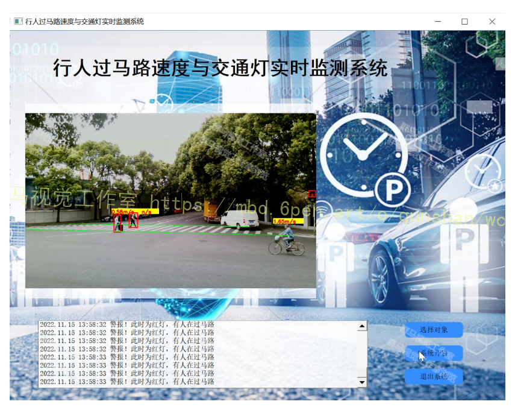

# 1.研究背景
横穿马路的行人运动速度太快、太慢或者突变都可能影响驾驶者的判断,从而导致交通事故。车载辅助系统应能够在交通路口为驾驶者提供异常行人的速度预判信息。文献[1-2]通过对不同红绿灯情形进行建模分析并实际采集某路段的交通视频,分析红绿灯与行人穿越马路的方式对行人安全性的影响,这种方法主要研究交通环境与行人安全的关系,受实际环境的影响较大。文献[3]同样以分析交通环境为主,主要研究夜间情况下交通信号灯的控制方案与行人车辆碰撞冲突的关系,通过实地采集交通数据,研究能保证行人安全和车辆正常通行的交通信号配时方案。文献[4]将关注点集中在人的头部,通过判断头部姿态预测行人可能的运动方向,将运动方向会与车辆发生冲突的行人判定为危险行人。传统算法检测速度较慢同时鲁棒性差，因此本文提出一种结合传统OpenCV算法的改进YOLOv7行人过马路速度与交通灯实时监测系统，为交通管理问题提供解决方案。

# 2.系统框架图


# 3.图片演示



# 4.视频演示
[基于改进YOLOv7＆OpenCV的行人过马路速度与交通灯实时监测系统（源码＆教程）_哔哩哔哩_bilibili](https://www.bilibili.com/video/BV1YR4y1Z7gN/?vd_source=bc9aec86d164b67a7004b996143742dc)
# 5.俯视行人位置变换

俯视变换的目的是针对单目摄像机，利用基于消失点的鲁棒逆透视映射变换，获得二维世界
坐标系下（不含 Ｚ 轴高度信息)的行人轨迹位置，逆透视映射示意图如图 。 线段 ＡB 和CD 为实际行车视角在俯视角下的边界线，线段ＡC 为车头所在位置。 坐标转换公式为

式中： (U，V ) 为行人在摄像机图片中的像素坐标; (M，N) 是图片的长和宽; (rx，ry ) 是行人在俯下的实际坐标; Cx，Cy，Cz是摄像机在世界坐标系中的位置; αU 和 αV 是摄像机在水平和垂直方向上的孔径角;θ 是摄像机相对于水平方向的倾斜角。 经计算可得，图中行人 i 和 j 在俯视角下的实际位置 rxi，ryi和 rxj，ryj。

# 6.目标检测算法
#### YOLOv7
YOLOv7论文在上个月6号挂在了Arxiv上之后，引起了巨大轰动，短短一个月的时间，Github上就有了4.3k个Star。


从论文题目可以看出来，YOLOv7又是一个集大成者的杰作；从Github源码可以看出， 整体结构与YOLOv5极其相似，因此有YOLOov5基础的小伙伴可以无脑上手v7。

另外来看下v7的两位大牛作者，一作是 Chien-Yao Wang，近几年一直耕耘在目标检测领域，尤其是YOLO系列，代表作：YOLOv7、YOLOR、ScaledYOLOv4、CSPNet等。二作是 Alexey Bochkovskiy，就是在20年Joseph Redmon宣布退出CV领域后扛起YOLO系列大旗并发布YOLOv4的那位大神。

#### 整体网络架构

YOLOv7[完整网络架构以及各组件的详细解析可以移步至该博客](https://mbd.pub/o/bread/Y5yTm51v)，这里从另一个角度来了解YOLOov7的网络架构：


上面这张图是根据我目前的理解，对YOLOv7的整体结构进行的拆分，可能会有不正确的地方，欢迎各位小伙伴前来交流~

可以很清楚的看到，YOLOv7大部分继承自YOLOv5，包括整体网络架构、配置文件的设置和训练、推理、验证过程等等，基本上熟悉v5就可以无脑上手v7了；此外，v7也有不少继承自YOLOR，毕竟是同一个作者前后年的工作，包括不同网络的设计、超参数设置以及隐性知识学习的加入；还有就是在正样本匹配时仿照了YOLOX的SimOTA策略。

除了这些在已有YOLO版本中的算法之外，YOLOv7还包括了近几年最新的trick：高效聚合网络（目前论文还未接收）、重参数化卷积、辅助头检测、模型缩放等等，因此学习YOLOv7还是非常有价值的。

#### 高效聚合网络


图a和图b是之前常用的特征提取网络，图c则是YOLOv7主要用到的ELAN网络，虽然有引文，但是并没有任何详细资料来学习，对此，作者是这么说的：

好叭，那就再等等。图d是对ELAN的改进，其等效网络就是下面这个，也就是两个ELAN（红框里）的Concat，作者的解释是：


#### 重参数化卷积

重参数化的作用：在保证模型性能的条件下加速网络，主要是对卷积+BN层以及不同卷积进行融合，合并为一个卷积模块。

下面给出了卷积+BN融合的公式化过程，红色表示卷积参数（权重和偏置），蓝色是BN参数（ m m m是输入均值， v v v是输入标准差， γ \gamma γ和 β \beta β是两个可学习的参数），最终经过一系列化简，融合成了一个卷积：


# 7.网络改进
#### 引入Swin Transformer
[参考该博可提出的改进方案](https://afdian.net/item?plan_id=365a702064b311edaf0052540025c377)，将 Transformer 从语言适应到视觉方面的挑战来自 两个域之间的差异，例如视觉实体的规模以及相比于文本单词的高分辨率图像像素的巨大差异。为解决这些差异，我们提出了一种 层次化 (hierarchical) Transformer，其表示是用 移位窗口 (Shifted Windows) 计算的。移位窗口方案通过 将自注意力计算限制在不重叠的局部窗口的同时，还允许跨窗口连接来提高效率。这种分层架构具有在各种尺度上建模的灵活性，并且 相对于图像大小具有线性计算复杂度。Swin Transformer 的这些特性使其与广泛的视觉任务兼容，包括图像分类（ImageNet-1K 的 87.3 top-1 Acc）和 密集预测任务，例如 目标检测（COCO test dev 的 58.7 box AP 和 51.1 mask AP）和语义分割（ADE20K val 的 53.5 mIoU）。它的性能在 COCO 上以 +2.7 box AP 和 +2.6 mask AP 以及在 ADE20K 上 +3.2 mIoU 的大幅度超越了 SOTA 技术，证明了基于 Transformer 的模型作为视觉主干的潜力。分层设计和移位窗口方法也证明了其对全 MLP 架构是有益的。

项目核心代码如下：
```
class SwinTransformer(nn.Module):
    def __init__(...):
        super().__init__()
        ...
        # absolute position embedding
        if self.ape:
            self.absolute_pos_embed = nn.Parameter(torch.zeros(1, num_patches, embed_dim))
            
        self.pos_drop = nn.Dropout(p=drop_rate)

        # build layers
        self.layers = nn.ModuleList()
        for i_layer in range(self.num_layers):
            layer = BasicLayer(...)
            self.layers.append(layer)

        self.norm = norm_layer(self.num_features)
        self.avgpool = nn.AdaptiveAvgPool1d(1)
        self.head = nn.Linear(self.num_features, num_classes) if num_classes > 0 else nn.Identity()

    def forward_features(self, x):
        x = self.patch_embed(x)
        if self.ape:
            x = x + self.absolute_pos_embed
        x = self.pos_drop(x)

        for layer in self.layers:
            x = layer(x)

        x = self.norm(x)  # B L C
        x = self.avgpool(x.transpose(1, 2))  # B C 1
        x = torch.flatten(x, 1)
        return x

    def forward(self, x):
        x = self.forward_features(x)
        x = self.head(x)
        return x
```

# 8.仿真测试

本文 采 用 单 目 摄 像 机， 仿 真 环 境 为 Windoｗs１０ 和 Python 3.7。 仿真所用参数 v０ =１． ２５ ， α = ０. ３ ， VFP = ３. ７５ ， VSP = １. ２５ ， VMIN =１ ， VMAX = ５ 。 仅对视频中的异常行人用实线检测框进行标识说明。慢速异常行人的横穿马路仿真场景如图 （ａ)在第 ４6 帧时，行人 B 被判定为慢速异常行人，此时 运 动 速 度 估 计 值 ０． ８３ m · s- １， VAD 为- ０． ３３;（b)为仿真视频第 ５４ 帧，从这一帧开始行人 Ａ 的速度稳定在 ０． ９２ m·s- １，对应的 VAD 为- ０． ２6，将行人 Ａ 判定为慢速异常行人;（c)为视频第 ９３ 帧，行人 B 速度估计值 ０． ７6 m·s- １，且VAD 为 - ０． ３９，为慢速异常行人。 在这 ３ 个场景的视频中可以看出，慢速异常行人穿越马路的速度明显低于正常行人，极容易滞留在街道路口，对驾驶员的注意提醒可以帮助区分行人是否完全通过马路。


# 9.系统整合
下图[**完整源码**＆**改进网络结构**＆环境部署视频教程＆红绿灯行人数据集＆自定义UI界面](https://s.xiaocichang.com/s/dbf144)


参考博客[《基于改进YOLOv7＆OpenCV的行人过马路速度与交通灯实时监测系统（源码＆教程）》](https://mbd.pub/o/qunma/work)


# 10.参考文献
[1][魏天舒](https://s.wanfangdata.com.cn/paper?q=%E4%BD%9C%E8%80%85:%22%E9%AD%8F%E5%A4%A9%E8%88%92%22),[尹丽菊](https://s.wanfangdata.com.cn/paper?q=%E4%BD%9C%E8%80%85:%22%E5%B0%B9%E4%B8%BD%E8%8F%8A%22),[高明亮](https://s.wanfangdata.com.cn/paper?q=%E4%BD%9C%E8%80%85:%22%E9%AB%98%E6%98%8E%E4%BA%AE%22),等.[一种自适应融合颜色和梯度方向特征的粒子滤波跟踪算法](https://d.wanfangdata.com.cn/periodical/sdgcxyxb201702004)[J].[山东理工大学学报（自然科学版）](https://sns.wanfangdata.com.cn/perio/sdgcxyxb).2017,(2).

[2][杨大伟](https://s.wanfangdata.com.cn/paper?q=%E4%BD%9C%E8%80%85:%22%E6%9D%A8%E5%A4%A7%E4%BC%9F%22),[郭超](https://s.wanfangdata.com.cn/paper?q=%E4%BD%9C%E8%80%85:%22%E9%83%AD%E8%B6%85%22),[吕伊鹏](https://s.wanfangdata.com.cn/paper?q=%E4%BD%9C%E8%80%85:%22%E5%90%95%E4%BC%8A%E9%B9%8F%22),等.[利用行人运动特性的TLD快速检测算法](https://d.wanfangdata.com.cn/periodical/dlmzxyxb201701009)[J].[大连民族大学学报](https://sns.wanfangdata.com.cn/perio/dlmzxyxb).2017,(1).

[3][刘丽华](https://s.wanfangdata.com.cn/paper?q=%E4%BD%9C%E8%80%85:%22%E5%88%98%E4%B8%BD%E5%8D%8E%22),[李小江](https://s.wanfangdata.com.cn/paper?q=%E4%BD%9C%E8%80%85:%22%E6%9D%8E%E5%B0%8F%E6%B1%9F%22),[许伟强](https://s.wanfangdata.com.cn/paper?q=%E4%BD%9C%E8%80%85:%22%E8%AE%B8%E4%BC%9F%E5%BC%BA%22),等.[一种夜间行人过街安全提示系统设计](https://d.wanfangdata.com.cn/periodical/hncjgdzkxxxb201506008)[J].[河南城建学院学报](https://sns.wanfangdata.com.cn/perio/hncjgdzkxxxb).2015,(6).DOI:[10.14140/j.cnki.hncjxb.2015.06.008](http://dx.chinadoi.cn/10.14140/j.cnki.hncjxb.2015.06.008).

[4][聂瑞红](https://s.wanfangdata.com.cn/paper?q=%E4%BD%9C%E8%80%85:%22%E8%81%82%E7%91%9E%E7%BA%A2%22),[程建川](https://s.wanfangdata.com.cn/paper?q=%E4%BD%9C%E8%80%85:%22%E7%A8%8B%E5%BB%BA%E5%B7%9D%22).[基于交通冲突技术的行人安全分析与改善](https://d.wanfangdata.com.cn/periodical/jtyjsj201203024)[J].[交通信息与安全](https://sns.wanfangdata.com.cn/perio/jtyjsj).2012,(3).DOI:[10.3963/j.ISSN1674-4861.2012.03.024](http://dx.chinadoi.cn/10.3963/j.ISSN1674-4861.2012.03.024).

[5][裴玉龙](https://s.wanfangdata.com.cn/paper?q=%E4%BD%9C%E8%80%85:%22%E8%A3%B4%E7%8E%89%E9%BE%99%22),[程坦](https://s.wanfangdata.com.cn/paper?q=%E4%BD%9C%E8%80%85:%22%E7%A8%8B%E5%9D%A6%22).[城市道路平面信号交叉口行人安全分析](https://d.wanfangdata.com.cn/periodical/jtyjsj200903027)[J].[交通信息与安全](https://sns.wanfangdata.com.cn/perio/jtyjsj).2009,(3).DOI:[10.3963/j.cn.42-1781.U.2009.03.027](http://dx.chinadoi.cn/10.3963/j.cn.42-1781.U.2009.03.027).

[6][Jun, Liu](https://s.wanfangdata.com.cn/paper?q=%E4%BD%9C%E8%80%85:%22Jun%2C%20Liu%22),[Gang, Wang](https://s.wanfangdata.com.cn/paper?q=%E4%BD%9C%E8%80%85:%22Gang%2C%20Wang%22),[Ling-Yu, Duan](https://s.wanfangdata.com.cn/paper?q=%E4%BD%9C%E8%80%85:%22Ling-Yu%2C%20Duan%22),等.Skeleton-Based Human Action Recognition With Global Context-Aware Attention LSTM Networks.[J].[IEEE transactions on image processing: a publication of the IEEE Signal Processing Society](https://sns.wanfangdata.com.cn/perio/EnJour00056381).2018,27(4).1586-1599.DOI:[10.1109/TIP.2017.2785279](http://dx.chinadoi.cn/10.1109/TIP.2017.2785279).

[7][Zhang, Daiming](https://s.wanfangdata.com.cn/paper?q=%E4%BD%9C%E8%80%85:%22Zhang%2C%20Daiming%22),[Fang, Bin](https://s.wanfangdata.com.cn/paper?q=%E4%BD%9C%E8%80%85:%22Fang%2C%20Bin%22),[Yang, Weibin](https://s.wanfangdata.com.cn/paper?q=%E4%BD%9C%E8%80%85:%22Yang%2C%20Weibin%22),等.[Robust inverse perspective mapping based on vanishing point](https://d.wanfangdata.com.cn/conference/CC0214555626)[C].2014

[8][Schulz, Andreas](https://s.wanfangdata.com.cn/paper?q=%E4%BD%9C%E8%80%85:%22Schulz%2C%20Andreas%22),[Stiefelhagen, Rainer](https://s.wanfangdata.com.cn/paper?q=%E4%BD%9C%E8%80%85:%22Stiefelhagen%2C%20Rainer%22).[Video-based pedestrian head pose estimation for risk assessment](https://d.wanfangdata.com.cn/conference/CC0212735266)[C].2012


---
#### 如果您需要更详细的【源码和环境部署教程】，除了通过【系统整合】小节的链接获取之外，还可以通过邮箱以下途径获取:
#### 1.请先在GitHub上为该项目点赞（Star），编辑一封邮件，附上点赞的截图、项目的中文描述概述（About）以及您的用途需求，发送到我们的邮箱
#### sharecode@yeah.net
#### 2.我们收到邮件后会定期根据邮件的接收顺序将【完整源码和环境部署教程】发送到您的邮箱。
#### 【免责声明】本文来源于用户投稿，如果侵犯任何第三方的合法权益，可通过邮箱联系删除。